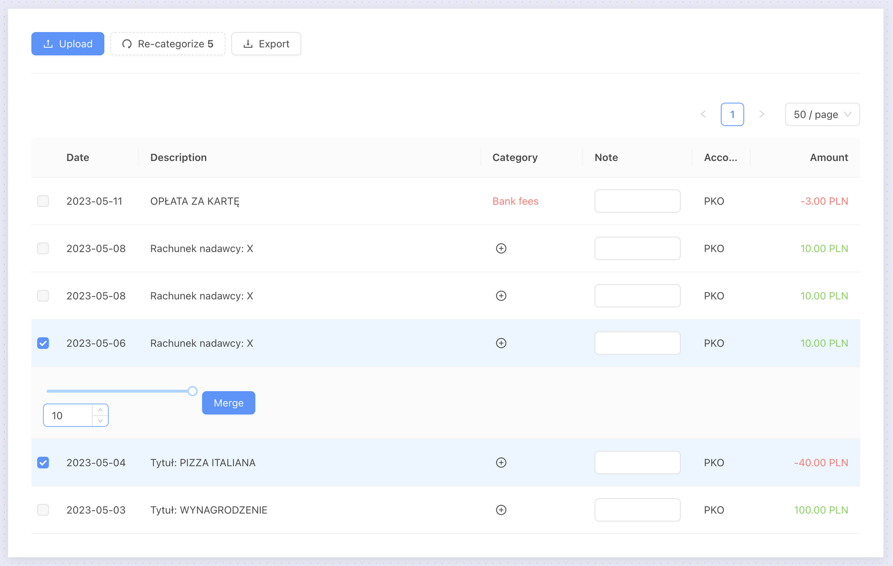

# Lunni - a tool for managing personal finance.



If you frequently:

- ✅ make shared orders with friends
- ✅ utilize many bank accounts

then Lunni can help you to better organize and analyze your finance data.

# Try it out!

Feel free to import this [example PKO statement file](./docs/example_pko.csv).

# What Lunni can do:

1. Import .csv bank statements:
   - mBank
   - mBank savings (so-called "Cele")
   - PKO
2. Transaction Table
   - View transaction chronologically sorted in a table
3. Transaction Notes
   - Assign notes e.g. to document ambiguous transactions
4. Transaction Merging
   - Merge transactions to combine incoming money with expenses
   - Useful for handling shared orders with friends
5. Transaction Categories
   - Define transaction categories of type:
     - POSITIVE: Incomes
     - NEGATIVE: Expenses
     - IGNORE: Hidden in reports and the transaction table
6. Category Matchers
   - Automate categorization process by assigning categories to transactions using `regex`
7. Export to .csv
   - Export financial data to analyze it in external tools, for example Tableau, PowerBI, Google Data Studio

The format is the following:

| id  | date       | description | note | account       | category_name | amount | calculated_amount |
| --- | ---------- | ----------- | ---- | ------------- | ------------- | ------ | ----------------- |
| 1   | 2023-05-11 | Description |      | Prywatne 1234 | Maintenance   | -50    | -50               |

Where `calculated_amount` is the resulting amount after merging transactions.

# What Lunni can **not** do:

- ❌ Support multiple users and separate the data

# Running the project

## Production environment (recommended)

Docker is required.

1. Create a `django_secrets.env` file in `/server` directory with the following contents:

```
SECRET_KEY=<your random secret id>
```

This key is used by Django for various cryptographic use cases, feel free to generate your own, for example at https://djecrety.ir.

2. Run `docker-compose up` to build the application
3. Visit the application at `http://localhost:80`

## Development environment

### Server

Python 3.11 is required.

1. Change directory to `/server`
2. `python manage.py migrate`
3. `python manage.py runserver`
4. Back-end server is running at http://localhost:8000

### Client

NodeJS 18.4 is required.

1. Change directory to `/client`
2. `npm install`
3. `npm start`
4. Front-end server is running at http://localhost:3000

# Future plans:

- Gradually add unit tests to cover newly found bugs
  // todo fix vulnerabilitiyes django

// todo landing page
